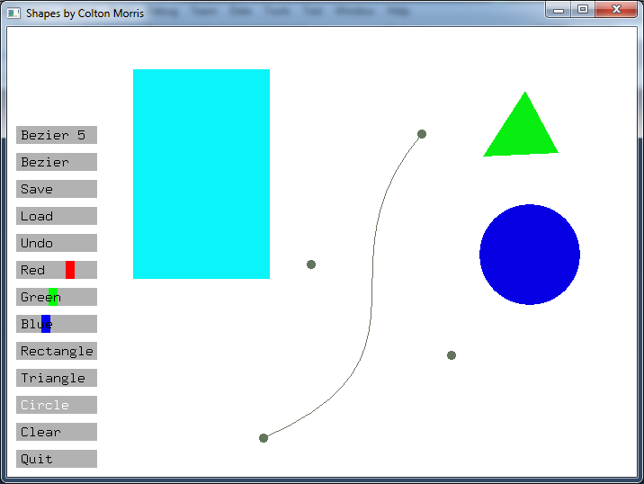

Shapes
======

This project's purpose was to practice polymorphism and inheritance.
Shape.h is the base class which the others are derived from.

You can draw simple, different colored shapes to the screen. You can also save your work and edit it another time, how great!
Quickly compile by using the make file.

#Screenshots

